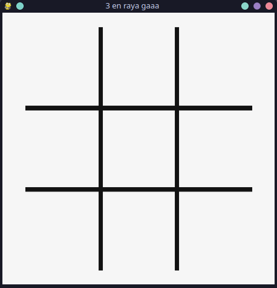
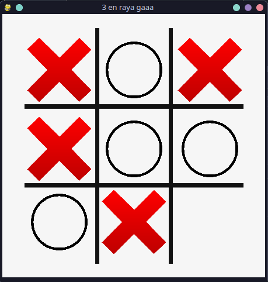
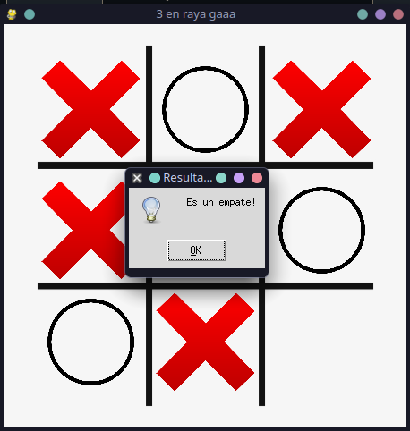

# Tres en Raya

## Descripción

Este es un juego de Tres en Raya (Tic Tac Toe) desarrollado en Python con la librería Pygame.

## Requisitos

- Python 3.x
- Pygame

## Instalación

1. Clonar el repositorio:

```bash
git clone https://github.com/davidmanueldev/tic-tac-toe-pygame.git
```

2. Instalar las dependencias:

> [!NOTE]
> Recomendable crearte un entorno virtual para instalar las dependencias. (Pero no es obligatorio)

```bash
python -m venv tres-en-raya
cd tres-en-raya/
```

> [!IMPORTANT]
> En Linux/MacOS es python3 y pip3

```bash
pip install -r requirements.txt
```

## Ejecución

Para ejecutar el juego, ejecutar el siguiente comando:

```bash
python main.py
```

## Capturas de pantalla





